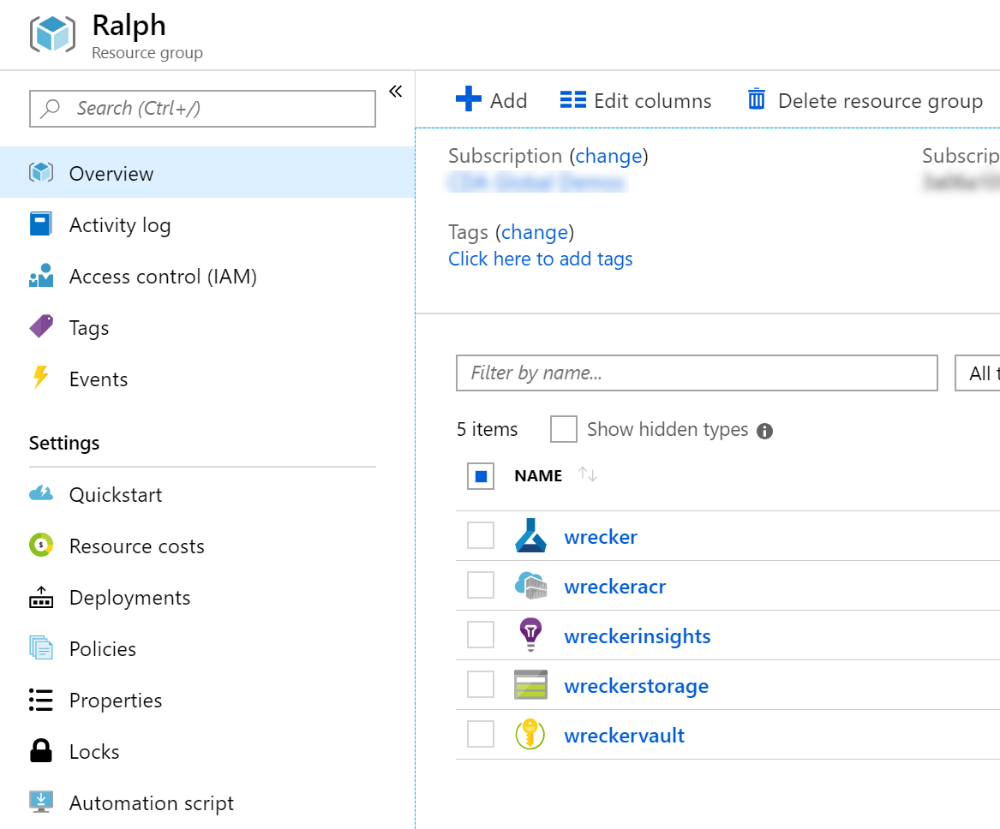

# Azure Machine Learning Workspace ARM Template
This is super handy for creating a brand new Azure Machine Learning service using the Azure CLI
and an [ARM template](workspace.json).

## Instructions
For example, one could do:
```
az group create --name Ralph --location "West US 2"

az group deployment create --name AMLWorkspace --resource-group Ralph --template-file workspace.json --parameters workspaceName=wrecker location="West US 2"
```

This will create a resource group named `Ralph` and an AML Workspace named `wrecker` together with the following resources:
1. Azure Container Registry named `wreckeracr`
2. Azure App Insights named `wreckerinsights`
3. Azure Storage Account named `wreckerstorage`
4. Azure Key Vault named `wreckervault`

## Final Deployment
After running the above commands, you should be able to see something
similar to my portal (see below).



## Questions?
Reach out to me if you have any questions!
